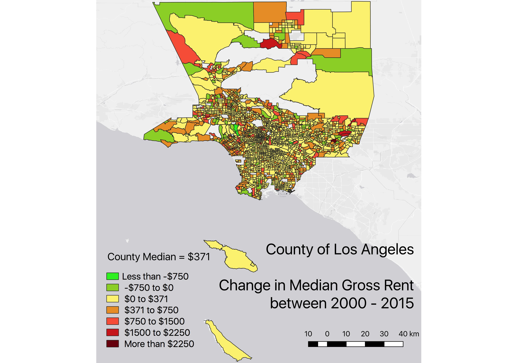

```{r eval=TRUE, include = FALSE, results='hide'}
r = getOption("repos")
r["CRAN"] = "http://cran.us.r-project.org"
options(repos = r)
install.packages("maptools")
install.packages("tmap")
install.packages("RColorBrewer")
install.packages("sp")
install.packages("rgeos")
install.packages("tmaptools")
install.packages("sf")
install.packages("rgdal") 
install.packages("geojsonio")
install.packages("shinyjs")
install.packages("dplyr")
install.packages("leaflet")
install.packages("citr")
```

```{r eval = TRUE, include=FALSE, results='hide'}
library(dplyr)
library(shinyjs)
library(maptools)
library(RColorBrewer)
library(sp)
library(rgeos)
library(tmap)
library(tmaptools)
library(sf)
library(rgdal)
library(geojsonio)
library(leaflet)
library(citr)
```

### Introduction


The overarching theme of this investigation is the quantification and mapping of gentrification in Los Angeles County, California. One key negative impact of gentrification is the displacement of lower income households due to steep rent increases. 

To analyse this spatial distribution, a map of the change in median gross rent from 2000 - 2015. Shapefiles are provided by the Los Angeles County GIS Data Portal [@lacounty_county_nodate] and rent data from the Urban Displacement Project [@uc_berkeley_urban_nodate]. 


### Part I - QGIS





Base layer for QGIS Map was  obtained from Spatial Analyst Felix Rohrbach's blog [@rohrbach_felix_awesome_2016].


__Critique of QGIS Mapping__


1. Accessibility - Add Layer options (e.g. WMS/WMTS) make using online resources simple
2. Intuitive - Due to affinities with software such as Photoshop, using GUI based mapping tools allows for much easier, intuitive execution of very specific manipulation, for instance of where exactly the legend, scales and title are located (rather than just in the corners). 
3. Data - Field Calculator provides an alternative to editing in excel and tools to join data also exist. However, interface of QGIS means that it is not easy to do data cleaning. Preparing data in excel is much easier visually speaking and in r much quicker if one knows the code involved 
4. __Quality of Map__ - Due to the fact that the data that was readily available was categorised by Census Tract, the __resulting map has too many small units__ that make simple visual distinction difficult at low resolutions. Solutions include printing the image in large paper sizes or alternatively using an __interactive map__, as attempted in Part II.


### Part II - r


Preparing variables and dataframe 
```{r}
#Loading LA County Census Tract polygons
LAcensustract <- rgdal::readOGR("Census Tracts 2010.geojson", "OGRGeoJSON")
sfLAcensustract <- st_as_sf(LAcensustract)
```

```{r}
#Reorder columns to make census tract nummber the first column which is the default hover visual for tmap_leaflet
sfLAcensustract <- sfLAcensustract[c(4,1,2,3,5,6,7,8)]
```

```{r}
#create variable from downloaded csv file with relevant information on house prices
ucladata <- read.csv('ucladata.csv')

#check for numeric class 
class(ucladata$chg_mgr15)
```


After preparing separate variables, join to create a combined variable:
```{r}
#Append census data to sfLAcensustract
CensusTractDataMap <- append_data(sfLAcensustract,ucladata, key.shp = "ct10", key.data = "Census_ID", ignore.duplicates = TRUE, ignore.na = FALSE)

#Remove any rows with missing data
CensusTractDataMap3 <- CensusTractDataMap[!(is.na(CensusTractDataMap$chg_mgr15)), ]
```


Plotting of maps using tmap and leaflet

```{r}
tm2 <- tm_shape(CensusTractDataMap3) +
  tm_polygons("chg_mgr15",
        style = "fixed", breaks = c(-Inf, -750, 0, 371, 750, 1500, 2500, Inf),
        palette = "-RdYlGn",
        midpoint=0,
        title="County Median = $371") +
  tm_scale_bar(position = c("right", "bottom")) +
  tm_layout(title = "Changes in Median Gross Rent, 2000-2015")

```

```{r}
#create leaflet
leaflet1 <- tmap_leaflet(tm2)
leaflet1
```


To Export for use in other software such as ArcGIS/QGIS:
```{r}
#convert to SP file first
class(CensusTractDataMap)
SPCensusTractDataMap <- as(CensusTractDataMap, "Spatial")

#writeSpatialShape(SPCensusTractDataMap, "export")
```

__Critique of R__

1. Interactive - Leaflet's drag, zoom, popup and turning layers on/off allows for intuitive manipulation of the map that overcomes the issue of high number of differing units preventing easy identification of areas
2. Accessibility - Just like in QGIS, accessing online resources using r is easy with the right packages
3. Variety of Methods - While only one method was used, there are a variety of different packages available (e.g. ggplot2, tmap) that provide differently structured methods for mapping, increasing user flexibility
4.Troubleshooting - Given the code-based interface and the variety of file types, commands, usage rules and arguments, it is often easy to run into time/energy sapping bugs (e.g. a continuous variable column that is used for generating legend categories being in 'factor' rather than 'numeric' class). Even users familiar with code-based mapping will continue to encounter such errors which may be difficult to detect and problematic to work around with limited coding expertise.

### Limitations and Conclusions

The maps indicate that while in general rent has been increasing across LA County, certain areas such as Venice/Santa Monica do show signs of much greater jumps, a quantitative indicator of the gentrification that has been well documented in those areas. Currently, this data suffers from limitations such as missing fields as well as the nature of the indicator used (change in median gross rent); given that there is no information regarding the distribution of household and household size, the possibility of changing unit sizes causing changes in gross rent cannot be ruled out. To better quantify and map the phenomenon, more indicators and more data from other time periods should be used (e.g. racial composition, commercial property value, home value, distribution of educated residents) to supplement this simple first step.

Regarding the two mapping techniques and their workflows, it was noted that a large proportion of time is spent on searching for appropriately labelled data and preparing/'cleaning' it, a process that requires manipulation of Excel and R depending on the situation. Given the demomnstrable advantages of each technique as outlined earlier, it is  arguably essential for spatial analysts to master both and indeed use them to complement each other. For instance, R can be used as a data cleaning and 'exploratory' step given the ease of producing maps quickly and conveniently using tmap packages. QGIS can then be used to create final products such as printable infographics where more finesse in design is necessary. Both techniques are compatible and their products exportable, thus facilitating such usage.


### References

