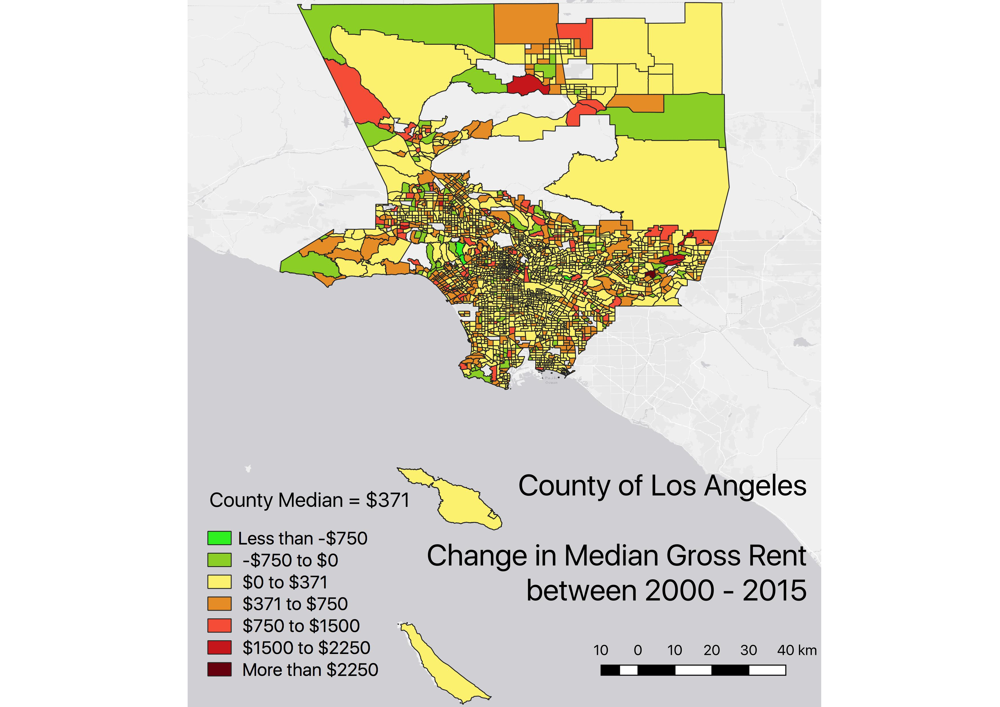

```{r eval = TRUE, include=FALSE, results='hide'}
library(dplyr)
library(shinyjs)
library(maptools)
library(RColorBrewer)
library(sp)
library(rgeos)
library(tmap)
library(tmaptools)
library(sf)
library(rgdal)
library(geojsonio)
library(leaflet)
library(citr)
```

#GIS Assessment Part 1

### Introduction


The overarching theme of this investigation is the quantification and mapping of gentrification in Los Angeles County, California. One key negative impact of gentrification is the displacement of lower income households due to steep rent increases. 

To analyse this spatial distribution, a map of the change in median gross rent from 2000 - 2015. Shapefiles are provided by the Los Angeles County GIS Data Portal and rent data from the Urban Displacement Project.

### Part I - QGIS





Base layer for QGIS Map was  obtained from Spatial Analyst Felix Rohrbach's blog (Rohrbach, 2016).


__Critique of QGIS Mapping__


1. Accessibility - Add Layer options (e.g. WMS/WMTS) make using online resources simple
2. Intuitive - Due to affinities with software such as Photoshop, using GUI based mapping tools allows for much easier, intuitive execution of very specific manipulation, for instance of where exactly the legend, scales and title are located (rather than just in the corners). 
3. Data - Field Calculator provides an alternative to editing in excel and tools to join data also exist. However, interface of QGIS means that it is not easy to do data cleaning. Preparing data in excel is much easier visually speaking and in r much quicker if one knows the code involved 
4. __Quality of Map__ - Due to the fact that the data that was readily available was categorised by Census Tract, the __resulting map has too many small units__ that make simple visual distinction difficult at low resolutions. Solutions include printing the image in large paper sizes or alternatively using an __interactive map__, as attempted in Part II.


### Part II - r


Preparing variables and dataframe 
```{r}
#Loading LA County Census Tract polygons
LAcensustract <- rgdal::readOGR("Census Tracts 2010.geojson", "OGRGeoJSON")
sfLAcensustract <- st_as_sf(LAcensustract)
```

```{r}
#Reorder columns to make census tract nummber the first column which is the default hover visual for tmap_leaflet
sfLAcensustract <- sfLAcensustract[c(4,1,2,3,5,6,7,8)]
```

```{r}
#create variable from downloaded csv file with relevant information on house prices
ucladata <- read.csv('ucladata.csv')

#check for numeric class 
class(ucladata$chg_mgr15)
```


After preparing separate variables, join to create a combined variable:
```{r}
#Append census data to sfLAcensustract
CensusTractDataMap <- append_data(sfLAcensustract,ucladata, key.shp = "ct10", key.data = "Census_ID", ignore.duplicates = TRUE, ignore.na = FALSE)

#Remove any rows with missing data
CensusTractDataMap3 <- CensusTractDataMap[!(is.na(CensusTractDataMap$chg_mgr15)), ]
```


Plotting of maps using tmap and leaflet

```{r}
tm2 <- tm_shape(CensusTractDataMap3) +
  tm_polygons("chg_mgr15",
        style = "fixed", breaks = c(-Inf, -750, 0, 371, 750, 1500, 2500, Inf),
        palette = "-RdYlGn",
        midpoint=0,
        title="County Median = $371") +
  tm_scale_bar(position = c("right", "bottom")) +
  tm_layout(title = "Changes in Median Gross Rent, 2000-2015")

```

```{r}
#create leaflet
leaflet1 <- tmap_leaflet(tm2)
leaflet1
```


To Export for use in other software such as ArcGIS/QGIS:
```{r}
#convert to SP file first
class(CensusTractDataMap)
SPCensusTractDataMap <- as(CensusTractDataMap, "Spatial")

#writeSpatialShape(SPCensusTractDataMap, "export")
```

__Critique of R__

1. Interactive - Leaflet's drag, zoom, popup and turning layers on/off allows for intuitive manipulation of the map that overcomes the issue of high number of differing units preventing easy identification of areas
2. Accessibility - Just like in QGIS, accessing online resources using r is easy with the right packages
3. Variety of Methods - While only one method was used, there are a variety of different packages available (e.g. ggplot2, tmap) that provide differently structured methods for mapping, increasing user flexibility
4.Troubleshooting - Given the code-based interface and the variety of file types, commands, usage rules and arguments, it is often easy to run into time/energy sapping bugs (e.g. a continuous variable column that is used for generating legend categories being in 'factor' rather than 'numeric' class). Even users familiar with code-based mapping will continue to encounter such errors which may be difficult to detect and problematic to work around with limited coding expertise.

### Limitations and Conclusions

The maps indicate that while in general rent has been increasing across LA County, certain areas such as Venice/Santa Monica do show signs of much greater jumps, a quantitative indicator of the gentrification that has been well documented in those areas. Currently, this data suffers from limitations such as missing fields as well as the nature of the indicator used (change in median gross rent); given that there is no information regarding the distribution of household and household size, the possibility of changing unit sizes causing changes in gross rent cannot be ruled out. To better quantify and map the phenomenon, more indicators and more data from other time periods should be used (e.g. racial composition, commercial property value, home value, distribution of educated residents) to supplement this simple first step.

Regarding the two mapping techniques and their workflows, it was noted that a large proportion of time is spent on searching for appropriately labelled data and preparing/'cleaning' it, a process that requires manipulation of Excel and R depending on the situation. Given the demomnstrable advantages of each technique as outlined earlier, it is  arguably essential for spatial analysts to master both and indeed use them to complement each other. For instance, R can be used as a data cleaning and 'exploratory' step given the ease of producing maps quickly and conveniently using tmap packages. QGIS can then be used to create final products such as printable infographics where more finesse in design is necessary. Both techniques are compatible and their products exportable, thus facilitating such usage.


### References


#GIS Assessment Part 2

### Data Collection and Processing
R was used due to its fantastic range of packages making GIS analysis easy and efficient

Data for the Team 7 (2016) route, London Wards (with City of London as one ward) and treasure hunt locations and scores was downloaded from Moodle and tube station data from doogal.co.uk (Chris Bell). 
For ease of data manipulation and visualisation, all data was converted to SF format. 

Data sanitisation was done using excel for erroneous data; for instance, coordinates for Platform 9 ¾ were wrong.

```{r data downloading}
#Team 7 route in 2016 data
library(geojsonio)
hunt <- geojson_read("https://www.dropbox.com/s/wa2ip35tcmt93g3/Team7.geojson?raw=1", what = "sp")

#quick visualisation
library(tmap)
tmap_mode("view")
tm_shape(hunt) +
  tm_lines(col = "green", lwd = 4)

#Tube stations 
library(rgdal)
tubestations <- readOGR("https://www.doogal.co.uk/LondonStationsKML.ashx", "London stations with zone information")

#Addresses of hunt
library(tidyverse)
huntaddresses <- read_csv("huntaddresses.csv")

#London Wards shapefiles (downloaded at the beginning of term)
LondonWards <- readOGR("LondonWards.shp")
LondonWardsSF <- st_as_sf(LondonWards)

#ensure crs is correct
st_crs(LondonWardsSF)
LondonWardsSF = LondonWardsSF %>% st_transform(4326) 
```
### Question 1 
The function ‘lengthLine’ [“geosphere” library] is used to calculate the length of the line when longitude and latitude are provided, thus avoiding error which would have resulted if Euclidean distance was calculated. 

```{r}
library(geosphere)
lengthLine(hunt)
```
Ans: 46610.68 meters

Nevertheless, a quick check of the Euclidean distance using the function st_length [“sf” library], which relies on the CRS of the geometric object (in this case WGS84), unsurprisingly returns the same result as the error is miniscule over such short distances.
```{r}
hunt_sf <- st_as_sf(hunt)
st_length(hunt_sf)
```

### Question 2
The function ‘st_is_within_distance’ [“sf” library] is used, a list of points in ‘tubestations_sf’ with a TRUE/FALSE value depending on whether they are within a distance of 100 from the hunt_sf line is returned in a matrix, with the column of TRUE/FALSE values ‘cbind’-ed back to ‘tubestations_sf’ and filtered so only the stations with TRUE values are returned:

```{r}
#convert tubestations to sf
tubestations_sf<- st_as_sf(tubestations, coords = c("coords.x1", "coords.x2"), crs = 4326)

#quick visualisation to ensure everything is in order
tm_shape(LondonWardsSF) +
  tm_polygons(col = NA, alpha = 0.5) +
  tm_shape(tubestations_sf) +
  tm_dots(col = 'blue') +
  tm_shape(hunt) +
  tm_lines(col = "green", lwd = 4)

#find tubestations within distance
tubestations100 = st_is_within_distance(tubestations_sf, hunt_sf, dist = 100, sparse = FALSE)
tubestations100 <- as.data.frame(tubestations100) #convert to dataframe
tubestations100 <- cbind(tubestations_sf, Within100 = tubestations100$V1)
tubestations100_filtered <- filter(tubestations100, Within100 == TRUE)
```

Ans:
1.	Abbey Road
2.	Bethnal Green
3.	Bethnal Green Rail
4.	Canary Wharf
5.	Canning Town
6.	Crossharbour and London Arena
7.	Cutty Sark for Maritime Greenwich
8.	Heron Quays
9.	Kings Cross St. Pancras
10.	Leicester Square
11.	Liverpool Street
12.	Mansion House
13.	Moorgate
14.	Mudchute
15.	Piccadilly Circus
16.	Pontoon Dock
17.	South Quay
18.	St Pancras
19.	Star Lane
20.	Stratford
21.	Stratford High Street
22.	West Ham
23.	West Silvertown
24. Westminster

### Question 3
Again, st_is_within_distance is used with ‘huntaddresses_sf’ at 300m instead and manipulated and filtered in the same way. 
```{r}
#visualisation
huntaddresses_sf<- st_as_sf(huntaddresses, coords = c("lon", "lat"), crs = 4326)

tm_shape(LondonWardsSF) +
  tm_polygons(col = NA, alpha = 0.5) +
  tm_shape(huntaddresses_sf) +
  tm_dots(col = 'blue') +
  tm_shape(hunt) +
  tm_lines(col = "green", lwd = 4)

#getting the list of points which were within 300m
huntlocations300 = st_is_within_distance(huntaddresses_sf, hunt_sf, dist = 300, sparse = FALSE)
huntlocations300 <- as.data.frame(huntlocations300) #convert to dataframe
huntlocations300 <- cbind(huntaddresses_sf, Within300 = huntlocations300$V1)
huntlocations300_filtered <- filter(huntlocations300, Within300 == TRUE)
```

Sum() is then used to obtain the total score. 
```{r}
sum(huntlocations300_filtered$Points)
```

### Question 4

Using the function ‘st_intersects’ [“sf” library] on the objects LondonWardsSF and hunt_sf followed by the same filtering procedure, the wards which the route went through can be obtained. 


```{r}
#visualisation
tm_shape(LondonWardsSF) +
  tm_polygons(col = NA, alpha = 0.5) +
  tm_shape(hunt) +
  tm_lines(col = "green", lwd = 4)

#obtaining intersecting wards
huntwards = st_intersects(LondonWardsSF, hunt_sf, sparse = FALSE) 
huntwards <- as.data.frame(huntwards)
huntwards <- cbind(LondonWardsSF, PassedThru = huntwards$V1)
huntwards <- filter(huntwards, PassedThru == TRUE)
#filter out unnecessary columns
huntwards <- huntwards[c("WardName", "MaleLE0509", "FemaleLE05", "ID", "PassedThru", "geometry")] 

```
Sorting by male life expectancy can be done using arrange() or by clicking on the column header in R Studio’s View window.

```{r}
huntwards %>% arrange(MaleLE0509)
```
The wards with lowest male life expectancy are Tower Hamlets - Bethnal Green South and Tower Hamlets - Weavers (74.8) while the ward with the highest life expectancy is City of London (82.8). 

If City of London is disqualified since it is technically a borough, the next highest is Westminster – West End (81.9).


### Question 5
The function mean() and summarise() are used on the ‘huntwards’ object to calculate and display the average male and female life expectancy, which is 77.98 and 83.56 years respectively.

```{r}
huntwards %>% 
  summarise(avg_male_le = mean(MaleLE0509), avg_female_le = mean(FemaleLE05))

```
### Question 6
Since it is the spatial distribution of discrete objects (hunt locations) rather than that of a continuous attribute being investigated, a Ripley’s K analysis will be used to check for spatial randomness instead of Moran’s I or Geary’s C. Furthermore, converting the points to a continuous density function for each ward (to use Moran’s I) would also have been problematic given the low count of hunt locations compared to ward numbers.

```{r}
LondonWardsSP <- readOGR("LondonWards.shp", layer="LondonWards")
huntaddresses_sp <- as(st_geometry(huntaddresses_sf), "Spatial")

#change CRS
LondonWardsSP_BNG <-spTransform(LondonWardsSP, CRS("+init=epsg:27700"))
LondonWardsSP_WGS <-spTransform(LondonWardsSP, CRS("+init=epsg:4326"))
huntaddresses_sp_BNG <- spTransform(huntaddresses_sp, "+init=epsg:27700")

#set a window as the borough boundary
library(GISTools)
library(spatstat)
window <- as.owin(LondonWardsSP_BNG)
plot(window)
```

```{r}
huntaddresses_BNG.ppp <- ppp(x=huntaddresses_sp_BNG@coords[,1],y=huntaddresses_sp_BNG@coords[,2],window=window)
plot(huntaddresses_BNG.ppp,pch=16,cex=0.5, main="Hunt Address")
```

```{r}
#Ripley's K for more accurate analysis of clustering
K <- Kest(huntaddresses_BNG.ppp, correction = "border")
plot(K)
```
```{r}
K1 <- Kest(huntaddresses_BNG.ppp)
plot(K1)
```


The plot shows that clustering is present by comparison to a poisson distribution (blue line).
One issue with using Ripley's K is a high computational load when there are too many points (in this case, still manageable).

To identify the clusters, DBSCAN analysis was used. 
DBSCAN requires you to input two parameters: 
1. Epsilon - this is the radius within which the algorithm with search for clusters
2. MinPts - this is the minimum number of points that should be considered a cluster
These two parameters were varied several times before they were chosen as the most appropriate based on visual inspection

```{r}
#extracting the points from the spdf
huntaddressesPoints <- data.frame(huntaddresses_sp_BNG@coords[,1:2])
#running the dbscan analysis
db <- fpc::dbscan(huntaddressesPoints, eps = 2200, MinPts = 3)
#now plot the results
plot(db, huntaddressesPoints, main = "DBSCAN Output", frame = F)
plot(LondonWardsSP_BNG, add=T)
```


Plotting DBSCAN results on a clearer map using ggplot2:
```{r}
library(ggplot2)
#add dbscan cluster membership info back into huntaddresses dataframe
huntaddressesPoints$cluster <- db$cluster

#Create convex hull polygons to wrap around the points
```
Here, the ddply function in the plyr package used to get the convex hull coordinates from the cluster groups in our dataframe
```{r}
library(plyr)
chulls <- ddply(huntaddressesPoints, .(cluster), function(df) df[chull(df$coords.x1, df$coords.x2), ])
#Drop 0s (as they are non-clustered points)
chulls <- subset(chulls, cluster>=1)

#Creating a ggplot2 object 
dbplot <- ggplot(data=huntaddressesPoints, aes(coords.x1,coords.x2, colour=cluster, fill=cluster)) 
#add the points 
dbplot <- dbplot + geom_point()
#add the convex hulls
dbplot <- dbplot + geom_polygon(data = chulls, aes(coords.x1,coords.x2, group=cluster), alpha = 0.5) 
#now plot, setting the coordinates to scale correctly and as a black and white plot (just for the hell of it)...
dbplot + theme_bw() + coord_equal()
```
Adding basemap:
```{r}
#Get the bbox in lat long 
LondonWardsSP_WGS@bbox
```

```{r}
library(OpenStreetMap)
basemap<-openmap(c(51.2867602,-0.5103751),c(51.6918741, 0.3340155), zoom=NULL,"stamen-toner")
#convert the basemap to British National Grid - remember we created the BNG object right at the beginning of the practical - it's an epsg string...
basemap_bng<-openproj(basemap, projection="+init=epsg:27700")
autoplot(basemap_bng) + geom_point(data=huntaddressesPoints, aes(coords.x1,coords.x2, colour=cluster, fill=cluster)) + geom_polygon(data = chulls, aes(coords.x1,coords.x2, group=cluster, fill=cluster), alpha = 0.5) 

```

### References

LACounty. “LA County StreetMap Mapserver.” Accessed November 2, 2018. http://public.gis.lacounty.gov/public/rest/services/LACounty_Cache/LACounty_StreetMap/MapServer.

UC Berkeley. “Urban Displacement Southern California Map | Urban Displacement Project.” Accessed November 2, 2018. http://www.urbandisplacement.org/map/socal.
