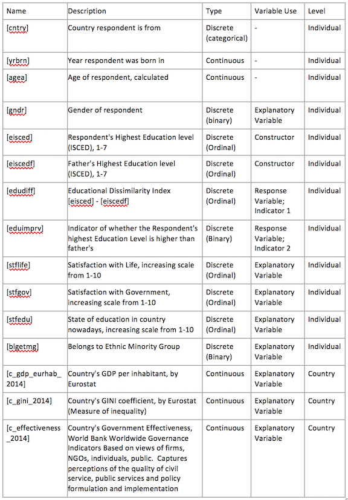

#GIS Assessment Part 3

## Exploring the spatial distribution and correlates of inter-generational educational mobility in Europe

### Introduction

Social mobility is a multifaceted phenomenon that can be explored from various perspectives such as class (e.g. EU report citation), income or education. While ideally all three are considered simultaneously, due to space and data constraints the scope of this study will be limited to educational advancement between generations, an important but incomplete indicator of relative social mobility. By visualising the spatial distribution of two indicators of what will be termed ‘Inter-Generational Educational Mobility’ (IGEM), this study aims to contribute to the understanding of how European countries fare in comparison with one another with regards to enabling citizens to obtain higher educational levels than their father. Furthermore, this study hopes to explore possible associations with IGEM to shed light on possible contributing factors to disparities in educational mobility.

### Description of Data, Indicators and Research Methods

This study’s data source is the European Social Survey (ESS) Multilevel Data, which is prepared and made available by the Norwegian Centre for Research Data. The ESS monitors public attitudes and values within Europe, focusing on topics such as politics, immigration, national identity amongst others. Due to dataset limitations including null values and some respondents’ refusal to answer certain questions, only 19 countries remain in the final dataset used in this study.

The key data columns are the education levels of the respondent and their father, recoded by the ESS into the International Standard Classification of Education (ISCED) scheme which harmonises respondents’ local qualifications across Europe for statistical comparability. There were used to code two IGEM indicators, an Educational Dissimilarity Index [edudiff] and a binary indicator of whether a respondent’s educational level exceeded their father’s [eduimprv].

ES – ISCED classification scheme

1.	ES-ISCED I, less than lower secondary

2.	ES-ISCED II, lower secondary

3.	ES-ISCED IIIA, lower tier upper secondary

4.	ES-ISCED IIIB, upper tier upper secondary

5.	ES-ISCED IV, advanced vocational, sub-degree

6.	ES-ISCED V1, lower tertiary education, BA level

7.	ES-ISCED V2, higher tertiary education, >= MA level

Respondents’ subjective satisfaction with life, the government and the education system are included in the regressions in order to explore if subjective wellbeing and attitudes to the country correlate with respondents’ IGEM indicators. Gender and self-identification of belonging to an ethnic minority group are also included to determine whether IGEM inequalities overlap with ethnic and gender divisions. Country-level socio-economic variables were also included to study possible statistical associations with IGEM indicators.



__Research Questions__

1.	How are European nations faring in providing opportunities for educational advancement in general as well as educational mobility for those from lower-educated family backgrounds?

2.	How is IGEM correlated with respondents’ gender, ethnic identity, satisfaction with life, the government and the education system as well as their country’s GDP, inequality and governmental effectiveness?


### Data Preparation
The data was sanitised by removing all entries with null or invalid responses (e.g. ‘refusal to answer’ or ‘others’). The dataset was also limited to respondents between 30 and to 115 years old since many respondents younger than that may not have completed their studies yet. 

```{r}
ESSdata <- read.csv("ESSdata.csv")

ESSdata <- subset(ESSdata, select = -c(nuts1, nuts2, nuts3))
ESSdata <- subset(ESSdata, cntry != "IL") #remove Israel as it is outside Europe
ESSdata <- ESSdata[ESSdata$agea > 29, ]
ESSdata <- ESSdata[ESSdata$agea < 115, ]
ESSdata <- ESSdata[ESSdata$eisced < 8, ]
ESSdata <- ESSdata[ESSdata$eiscedf < 8, ]
ESSdata <- ESSdata[!is.na(ESSdata$cntry), ] #remove NAs
```


Shapefiles for the EU countries were obtained from the Database of Global Administrative Areas (GADM) in .rds format using the getData() function (raster library). Since the GADM files contain millions of points, the polygons need to be simplified using the gSimplify function (rgeos library) to speed up the plotting. The function simplifies the geometry using the Douglas-Peuker algorithm to decimate a curve into a similar one with fewer points.

```{r}
library(raster)
#citation: from viktoriawagner
ctry <- c("AUT", "BEL", "CHE", "CZE", "DEU", "DNK", "ESP", "EST", 
          "FIN", "FRA", "GBR", "IRL", "LTU", "NLD", "NOR", "POL", 
          "PRT", "SWE", "SVN")
europe.l <- vector("list", length(ctry))

# Below code was used to download, skipped as files have been included in zip
#for(i in 1:length(europe.l)) {
#  europe.l[[i]] <- getData("GADM", country=ctry[i], 
#                           level=0)
#}
```

```{r}
library(rgeos)
data = data.frame(ESSRound="ESS7")

AT <- readRDS("gadm36_AUT_0_sp.rds")
AT_sim <- gSimplify(AT, tol=0.01, topologyPreserve=TRUE)
AT_sim_spdf = SpatialPolygonsDataFrame(AT_sim,data)

BE <- readRDS("gadm36_BEL_0_sp.rds")
BE_sim <- gSimplify(BE, tol=0.01, topologyPreserve=TRUE)
BE_sim_spdf = SpatialPolygonsDataFrame(BE_sim,data)

CH <- readRDS("gadm36_CHE_0_sp.rds")
CH_sim <- gSimplify(CH, tol=0.01, topologyPreserve=TRUE)
CH_sim_spdf = SpatialPolygonsDataFrame(CH_sim,data)

CZ <- readRDS("gadm36_CZE_0_sp.rds")
CZ_sim <- gSimplify(CZ, tol=0.01, topologyPreserve=TRUE)
CZ_sim_spdf = SpatialPolygonsDataFrame(CZ_sim,data)

DE <- readRDS("gadm36_DEU_0_sp.rds")
DE_sim <- gSimplify(DE, tol=0.01, topologyPreserve=TRUE)
DE_sim_spdf = SpatialPolygonsDataFrame(DE_sim,data)

DK <- readRDS("gadm36_DNK_0_sp.rds")
DK_sim <- gSimplify(DK, tol=0.01, topologyPreserve=TRUE)
DK_sim_spdf = SpatialPolygonsDataFrame(DK_sim,data)

EE <- readRDS("gadm36_EST_0_sp.rds")
EE_sim <- gSimplify(EE, tol=0.01, topologyPreserve=TRUE)
EE_sim_spdf = SpatialPolygonsDataFrame(EE_sim,data)

ES <- readRDS("gadm36_ESP_0_sp.rds")
ES_sim <- gSimplify(ES, tol=0.01, topologyPreserve=TRUE)
ES_sim_spdf = SpatialPolygonsDataFrame(ES_sim,data)

FI <- readRDS("gadm36_FIN_0_sp.rds")
FI_sim <- gSimplify(FI, tol=0.01, topologyPreserve=TRUE)
FI_sim_spdf = SpatialPolygonsDataFrame(FI_sim,data)

FR <- readRDS("gadm36_FRA_0_sp.rds")
FR_sim <- gSimplify(FR, tol=0.01, topologyPreserve=TRUE)
FR_sim_spdf = SpatialPolygonsDataFrame(FR_sim,data)

GB <- readRDS("gadm36_GBR_0_sp.rds")
GB_sim <- gSimplify(GB, tol=0.01, topologyPreserve=TRUE)
GB_sim_spdf = SpatialPolygonsDataFrame(GB_sim,data)

IE <- readRDS("gadm36_IRL_0_sp.rds")
IE_sim <- gSimplify(IE, tol=0.01, topologyPreserve=TRUE)
IE_sim_spdf = SpatialPolygonsDataFrame(IE_sim,data)

LT <- readRDS("gadm36_LTU_0_sp.rds")
LT_sim <- gSimplify(LT, tol=0.01, topologyPreserve=TRUE)
LT_sim_spdf = SpatialPolygonsDataFrame(LT_sim,data)

NL <- readRDS("gadm36_NLD_0_sp.rds")
NL_sim <- gSimplify(NL, tol=0.01, topologyPreserve=TRUE)
NL_sim_spdf = SpatialPolygonsDataFrame(NL_sim,data)

NO <- readRDS("gadm36_NOR_0_sp.rds")
NO_sim <- gSimplify(NO, tol=0.01, topologyPreserve=TRUE)
NO_sim_spdf = SpatialPolygonsDataFrame(NO_sim,data)

PL <- readRDS("gadm36_POL_0_sp.rds")
PL_sim <- gSimplify(PL, tol=0.01, topologyPreserve=TRUE)
PL_sim_spdf = SpatialPolygonsDataFrame(PL_sim,data)

PT <- readRDS("gadm36_PRT_0_sp.rds")
PT_sim <- gSimplify(PT, tol=0.01, topologyPreserve=TRUE)
PT_sim_spdf = SpatialPolygonsDataFrame(PT_sim,data)

SE <- readRDS("gadm36_SWE_0_sp.rds")
SE_sim <- gSimplify(SE, tol=0.01, topologyPreserve=TRUE)
SE_sim_spdf = SpatialPolygonsDataFrame(SE_sim,data)

SI <- readRDS("gadm36_SVN_0_sp.rds")
SI_sim <- gSimplify(SI, tol=0.01, topologyPreserve=TRUE)
SI_sim_spdf = SpatialPolygonsDataFrame(SI_sim,data)


EUR <- rbind(AT_sim_spdf, BE_sim_spdf, CH_sim_spdf, CZ_sim_spdf, DE_sim_spdf, DK_sim_spdf, EE_sim_spdf, 
            ES_sim_spdf,FI_sim_spdf, FR_sim_spdf, GB_sim_spdf, IE_sim_spdf, LT_sim_spdf, NL_sim_spdf, 
            NO_sim_spdf, PL_sim_spdf, PT_sim_spdf, SE_sim_spdf, SI_sim_spdf)
```

### Descriptive Statistics Plot 1: [edudiff]

The first indicator of IGEM plotted is an Index of Educational Dissimilarity [edudiff], the difference between the respondent’s highest educational level and their father’s. A mean figure for each country was calculated by simultaneously applying the groupby() and summarise() functions using a pipe operator (dplyr library).

```{r}
ESSdata$edudiff <- ESSdata$eisced - ESSdata$eiscedf

#calculate each country's mean respondents' and father's highest educational level 
library(dplyr)
meanedulvl_by_cntry <- ESSdata %>%
  group_by(cntry) %>%
  summarise(meanedulvl = mean(eisced, na.rm=TRUE))

EUR@data = data.frame(EUR@data, meanedulvl_by_cntry)

meanedulvlf_by_cntry <- ESSdata %>%
  group_by(cntry) %>%
  summarise(meanedulvlf = mean(eiscedf, na.rm=TRUE))

EUR@data = data.frame(EUR@data, meanedulvlf_by_cntry)

#obtain the Educational Dissimilarity Index (mean difference in education level between father and respondent) for each country
EUR_meanedudiff <- mean(ESSdata$edudiff)
EUR_meanedudiff

meanedudiff_by_cntry <- ESSdata %>%
  group_by(cntry) %>%
  summarise(meanedudiff = mean(edudiff, na.rm=TRUE))

#join the Index to the map
EUR@data = data.frame(EUR@data, meanedudiff_by_cntry)
#to plot on an interactive map of descriptive statistics

library(tmap)
tmap_mode("view")
tm_shape(EUR) +
  tm_polygons("meanedudiff",
              style = "fixed", breaks = c(-Inf, 0.5, 1, 1.25, 1.5, 1.75, Inf),
              palette="RdYlGn",
              midpoint=0,
              title="Dissimilarity Index (EUR-wide: 1.31)",
              popup.vars = c("cntry", "meanedulvl", "meanedulvlf", "meanedudiff") )
```

The strong performance of northern European countries. This result provides strong support for Scandinavian welfare systems’ provision of high quality education at no or low cost. Finland’s mean edudiff (1.8) is the highest, a testament to their world-renowned education system from pre-primary to tertiary levels. 

On the other end of the spectrum, central European countries (GER, SWI, CZE, AUT) have the poorest performance. No immediate explanation is apparent, though the next visualisation is suggestive. 

### Descriptive Statistics Plot 2: [eduimprv]

To further explore the nuances of IGEM across Europe, a second plot was created to display the odds of a respondent’s highest education level being higher than their father’s in each country. A binary variable (eduimpr) was coded and added to the dataframe that indicates if a respondent’s highest education level is higher than their father’s. Furthermore, in order to focus on the upward mobility of those from backgrounds of lower education, the dataset was filtered to only include respondents whose father’s highest education level was secondary or below (ISCED < 3).
	
A function was created to calculate the odds for each country and the results plotted using the tmap library again.
 
```{r}
#filter out those with father's education above lower secondary
ESSdata_sub <- ESSdata[ESSdata$eiscedf < 3, ]

##calculate for the entire EU the odds of a respondent from such backgrounds having a higher education level than their father
# count of people with edudiff > 0 divided by count of people with edudiff < 1 
edu_impr_count <- sum(ESSdata_sub$edudiff > 0, na.rm=TRUE)
edu_not_impr_count <- sum(ESSdata_sub$edudiff < 1, na.rm=TRUE)
edu_impr_odds <- edu_impr_count/edu_not_impr_count
edu_impr_odds


edu_impr_odds_calculator <- function(country) {
  temp_ESSdata_sub <- ESSdata_sub[ESSdata_sub$cntry == country, ]
  temp_impr_count <- sum(temp_ESSdata_sub$edudiff > 0, na.rm=TRUE)
  temp_not_impr_count <- sum(temp_ESSdata_sub$edudiff < 1, na.rm=TRUE)
  odds <- temp_impr_count/temp_not_impr_count
  return(odds)
}
##calculate for individual countries and merge it with a dataframe with the 19 countries
ESSdata_sub_counts <- count(ESSdata_sub, cntry) #check if there are enough observations per country
ESSdata_sub_counts
```

```{r}
AT_odds <- edu_impr_odds_calculator("AT")
BE_odds <- edu_impr_odds_calculator("BE")
CH_odds <- edu_impr_odds_calculator("CH")
CZ_odds <- edu_impr_odds_calculator("CZ")
DE_odds <- edu_impr_odds_calculator("DE")
DK_odds <- edu_impr_odds_calculator("DK")
EE_odds <- edu_impr_odds_calculator("EE")
ES_odds <- edu_impr_odds_calculator("ES")
FI_odds <- edu_impr_odds_calculator("FI")
FR_odds <- edu_impr_odds_calculator("FR")
GB_odds <- edu_impr_odds_calculator("GB")
IE_odds <- edu_impr_odds_calculator("IE")
LT_odds <- edu_impr_odds_calculator("LT")
NL_odds <- edu_impr_odds_calculator("NL")
NO_odds <- edu_impr_odds_calculator("NO")
PL_odds <- edu_impr_odds_calculator("PL")
PT_odds <- edu_impr_odds_calculator("PT")
SE_odds <- edu_impr_odds_calculator("SE")
SI_odds <- edu_impr_odds_calculator("SI")

list_odds <- list(AT_odds, BE_odds, CH_odds, CZ_odds, DE_odds, DK_odds, EE_odds, ES_odds, FI_odds, FR_odds, GB_odds, IE_odds, LT_odds, NL_odds, NO_odds, PL_odds, PT_odds, SE_odds, SI_odds)

ESSdata_sub_counts$odds <- sapply(list_odds, paste0)

#join the Index to the map
EUR@data = data.frame(EUR@data, ESSdata_sub_counts)
EUR@data$odds <- as.numeric(EUR@data$odds)

#to plot on an interactive map of descriptive statistics
tmap_mode("view")
tm_shape(EUR) +
  tm_polygons("odds",
              style ="fixed", 
              breaks = c(-Inf, 1, 2, 3, 4, 5, 6, 7, Inf),
              palette="RdYlGn",
              midpoint=2.77,
              title="Odds of edulvl improving (EUR-wide: 2.77)",
              popup.vars = c("cntry", "meanedulvl", "meanedulvlf", "meanedudiff", "odds") )

```
 
The low odds of Spain and Portugal immediately stand out and are indicative of the poor prospects for youth in the two Southern European economies. A possible link is that high youth unemployment and underemployment have reduced the attractiveness of furthering their education. Lack of investment into education due to national debts owed to international lenders is also a noted problem in Portugal (Roberts 2013), the country with by far the lowest odds at 0.80 in the dataset, that risks doing long term damage to the Portuguese economy.

On the other hand, high odds of inter-generational educational advancement in the former Soviet countries Lithuania and Estonia is perhaps indicative of the well-implemented reforms revamping the Soviet era systems as outlined by Pranevičienė and Margevičiūtė (2015). The previously noted strong performance of the Scandinavian countries is corroborated by their high odds of educational advancement.

Comparison with the first plot [edudiff] also brings further insight. While the UK previously appeared to have a strong educational mobility performance, when the prospects of only the lowest educated are considered there are clearly worryingly low odds of educational advancement (1.83 vs 2.85 for all countries). Also, a more nuanced picture of the four central European nations that were considered poor performers on the edudiff indicator is now apparent; Germany, Switzerland and Czech Republic show decently high odds of educational advancement for those from lower education family backgrounds, suggesting that the influence of family origins is not as strong as previously suggested. 

Austria however, has a well-documented issue of low graduate rates (about 20% university graduates versus 30% OECD average; Langley, 2015). Perhaps a possible explanation for these results is the structure of the education system which funnels many students, especially those from migrant families who have poor German literacy, into vocational training. These results thus corroborate the claims of Austrian politician Andreas Salcher who describes how this “dual system, originally meant to prepare students for practical jobs, has instead become a dumping ground” for those from the poorest, lowest educated backgrounds who have little chance of moving up (ibid.).


### Correlates of Inter-generational educational advancement 

In order to investigate whether the country level and individual level variables outlined earlier are correlated with whether an individual’s highest educational level has improved in comparison to their father’s [eduimprv] and the magnitude of any improvement [edudiff], a multilevel logistic regression and multilevel linear regression were employed respectively. This form of regression avoids possible biased estimates of standard error that may occur when the data is nested/clustered and both variables on two ‘levels’ (country and individual) are regressed. However, the results indicates a failure to converge, likely due to quasi-complete data patterns that mean maximum likelihood estimates do not exist (Allison, 2008). 

```{r}
ESSdata_sub_mlr <- ESSdata_sub[ESSdata_sub$stflife < 11, ]
ESSdata_sub_mlr <- ESSdata_sub_mlr[ESSdata_sub_mlr$stfgov < 11, ]
ESSdata_sub_mlr <- ESSdata_sub_mlr[ESSdata_sub_mlr$stfedu < 11, ]
ESSdata_sub_mlr <- ESSdata_sub_mlr[ESSdata_sub_mlr$blgetmg < 3, ]
ESSdata_sub_mlr <- ESSdata_sub_mlr[ESSdata_sub_mlr$gndr < 3, ]

library(lme4)
ESSdata_sub_mlr$eduimprv <- ifelse(ESSdata_sub_mlr$edudiff > 0, 1, 0)

modelmlr <- lmer(edudiff ~ (1 | cntry) + gndr + stflife + stfgov + stfedu + blgetmg + c_gdp_eurhab_2014 + c_gini_2014 + c_effectiveness_2014, data=ESSdata_sub_mlr)
modellogisticmlr <- glmer(eduimprv ~ (1 | cntry) + gndr + stflife + stfgov + stfedu + blgetmg + c_gdp_eurhab_2014 + c_gini_2014 + c_effectiveness_2014,family=binomial("logit"), data=ESSdata_sub_mlr)
summary(modelmlr)
summary(modellogisticmlr)
```

Thus, since the multilevel regression produced unreliable results, a multiple linear regression and multiple logistic regression were then used instead to study individual level regressions.

```{r}
modelOLS <- lm(edudiff ~ gndr + stflife + stfgov + stfedu + blgetmg, data=ESSdata_sub_mlr)
modellogistic <- glm(eduimprv ~ gndr + stflife + stfgov + stfedu + blgetmg,family=binomial(link='logit'), data=ESSdata_sub_mlr)
summary(modelOLS)
summary(modellogistic)

#Conversion of estimates of log-odds into odds
res_odds_stflife <- exp(0.0691464)
res_odds_stfgov <- exp(0.0426989)
res_odds_blgetmg <- exp(-0.5471046)
res_odds_stflife
res_odds_stfgov
res_odds_blgetmg
```


Since the estimates for [gndr] were statistically significant in only the first regression, the results were deemed unreliable and no conclusion was drawn about the impact of gender.

[blgetmg] is negatively correlated to both [eduimprv] and [edudiff], providing statistical evidence suggesting that a respondent belonging to a minority ethnic group is expected to have lower odds (0.56 times lower) to improve on their father’s education level as well as expected to have a lesser [edudiff] score (-0.459) as compared to a respondent who is not from a minority ethnic group, holding the other variables constant. While the magnitude of the variable in [edudiff] is not large relative to its 7-point scale, 0.56 times lower odds indicates quite a large deficit between the educational mobility of a respondent from an ethnic minority. 

[stflife] and [stfgov] both have statistically significant and relatively small positive estimates with [edudiff] and [eduimprv], suggesting that a respondent with inter-generational educational advancement and a higher magnitude of advancement is expected to be more satisfied with both life and the government.

Overall however, both models are poor fits to the data as indicated by the low adjusted R-squared (0.02) and the small difference between the null and residual deviance (15464, 15328), indicating that the majority of the variance in [eduimprv] logodds and [edudiff] is still unexplained by the variables included.

### Limitations and Conclusions

One study limitation stems from the uniqueness of education systems across different nations. For instance, countries like Germany have systems where vocational training is an integral part of the education system and economy. Thus, the harmonisation of educational levels using the ES-ISCED scheme may obscure country-specific differences in the quality of life and/or employment associated with each level of educational achievement. The costs associated with education also differ across countries but is not accounted for in this study. 

The indicators used also do not present a full picture of the life opportunities and achievements of respondents. Further research should be conducted with data on father and child’s income and occupational class status for a more complete picture of social mobility in Europe.

A possible policy in response to migrants being expected to have lower educational mobility would be to sponsor programs such as language classes for both migrant children and families. Another alternative is to consider some form of academic affirmative action that applies to tertiary educational institutions. However, affirmative action may be controversial due to issues of equity, unpopularity and possible weakening of student motivation.

Overall, the study has shown that while in general adult Europeans have experienced inter-generational educational advancement, this success has varied sharply across countries. Scandinavia has largely performed strongly while countries like Portugal and Spain may require a rethink in educational and labour policies to prevent generational stagnation. The importance of improving educational mobility is also underlined by its association with life and government satisfaction; the results seem to indicate more mobility equals more satisfied citizens, though more research is needed to determine causality.

### References

Allison, Paul D. “Convergence Failures in Logistic Regression,” 360:1–11, 2008.

Langley, Alison. “Austria’s Teaching System under Intense Pressure to Achieve.” Financial Times, October 20, 2015. https://www.ft.com/content/ed30c46c-669a-11e5-97d0-1456a776a4f5.

Pranevičienė, Birutė. “Challenges to the Implementation of Institutional Reform in the Lithuanian General Education System.” Baltic Journal of Law and Politics 8, no. 1 (July 27, 2015): 106–38. https://doi.org/10.1515/bjlp - 2015 - 0013.

Roberts, Martin. “Portugal’s Fed-up Youth Pack and Go as Their Nation Slides into Reverse.” The Guardian, April 13, 2013. https://www.theguardian.com/world/2013/apr/13/portugal-slides-into-reverse.

Rohrbach, Felix. “Awesome Basemap Layer for Your QGIS Project.” Awesome Basemap Layer for Your QGIS Project (blog), February 16, 2016. http://felix.rohrba.ch/en/2016/awesome-basemap-layer-for-your-qgis-project/.

Uhlová, Saša. “If the Czech Economy Is Thriving, Why Are We so Poor?” The Guardian, September 19, 2018. https://www.theguardian.com/commentisfree/2018/sep/19/czech-republic-transition-state-socialism-capitalism.

Wagner, Viktoria. “Euro+Med Base Map in R,” April 20, 2016. http://viktoriawagner.weebly.com/blog/euromed-base-map-in-r.
